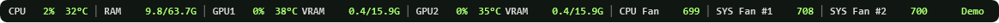

# RigPulse

A compact, read-only Windows hardware monitor with multi-GPU support.

CPU load and temperature · physical RAM · each GPU's load, temperature and dedicated VRAM · motherboard fan RPM.



*Synthetic demo readings. Actual values depend on your hardware.*

RigPulse grew out of a PowerShell desktop overlay. This version is a compiled Windows application: no PowerShell polling, no Python and no separately installed .NET runtime. The installer contains the application and its runtime.

## Download

Get a Windows x64 installer or portable EXE from [Releases](https://github.com/nazntrade/rigpulse/releases). Early builds are previews. **A build is Authenticode-signed only when the release explicitly says so.** Unsigned review builds are labeled unsigned; a checksum is not an Authenticode signature. Trusted publisher signing needs a code-signing certificate or signing service. A self-signed certificate does not establish publisher trust on other people's PCs.

## Use

1. Install `RigPulse-Setup-<version>-win-x64.exe`, or run the portable EXE.
2. The overlay appears just above the taskbar. Right-click it or the tray icon for Settings.
3. Adjust font size, opacity, display, fan count and start at sign-in. Settings are per-user.
4. If CPU temperatures or motherboard fans show `--`, try **Restart as administrator** from the tray menu. CPU/RAM counters and many GPU sensors work without elevation; other sensors require driver access. Unsupported sensors may still show `--`.

The installer also contains the **official signed PawnIO 2.1.0 sensor driver**. Its optional task appears only when the driver is missing. Installing that system component requires administrator approval. An existing PawnIO installation is kept; uninstalling RigPulse leaves this shared driver installed. Portable users need an existing sensor driver for CPU temperature / motherboard RPM, or can use the setup file's optional task. Neither format requires installing .NET separately.

No fan speeds, voltages, clocks, power limits or overclock settings are changed. FanControl can continue controlling your fans independently.

**Stable width:** thin dividers separate CPU, RAM, each GPU and individual fans; values occupy fixed-width cells. `1% → 100%`, `32°C → 100°C` and changing RAM/RPM values do not resize the bar. The layout changes only when settings or available hardware change. A narrow display wraps cells while keeping their widths fixed. Units marked `G` are GiB (1024³ bytes).

## Hardware and freshness

- CPU utilization uses Windows `GetSystemTimes`; physical RAM uses `GlobalMemoryStatusEx`. CPU utilization can differ from frequency-adjusted “CPU utility” in other monitors.
- CPU temperatures, AMD/Intel GPU sensors and motherboard fan RPM come from [LibreHardwareMonitor 0.9.6](https://github.com/LibreHardwareMonitor/LibreHardwareMonitor/tree/v0.9.6). NVIDIA readings use the driver-supplied NVML API with a separate device UUID and driver index for each GPU. GPU1 corresponds to NVIDIA index 0. Intel graphics are not substituted for a second NVIDIA GPU.
- NVIDIA VRAM uses NVML's allocated-memory figure, matching `nvidia-smi` units after conversion to GiB. Older drivers that lack the v2 API fall back to the v1 figure, which includes driver-reserved memory. Motherboard fan slots reporting zero at initial discovery are omitted; the selected active slots stay selected even if their RPM later falls to zero. Restart the app after connecting a new fan.
- Two independent compiled worker processes poll once per second. The UI never waits for sensor reads. A stuck sensor worker cannot freeze CPU/RAM updates or the window.
- Readings older than five seconds show `--` and `Stale`; the last hardware layout remains visible. A worker that produces no readings for twenty seconds is restarted. Missing motherboard sensors depend on hardware support, privileges and Windows driver policy; RigPulse does not bypass that policy.
- AMD and Intel support depends on LibreHardwareMonitor and has not yet been validated on physical AMD/Intel GPUs. This preview is being tested on a Windows PC with two RTX 5060 Ti cards.

## Settings and diagnostics

Settings: `%LOCALAPPDATA%\RigPulse\settings.json`. Errors: `rigpulse.log` in the same folder. Settings survive uninstall; the uninstall process removes the sign-in entry.

Optional `FanLabels` maps diagnostic sensor IDs to short names, for example `"/lpc/nct6798d/0/fan/0": "CPU Fan"`. This affects labels only. Actual fan labels and IDs vary by motherboard.

```powershell
.\RigPulse.exe --diagnostics --output "$env:TEMP\rigpulse-diagnostics.json"
```

This collects eight seconds of readings without opening the overlay. The report includes GPU/sensor identifiers and hardware names; inspect it before sharing. It contains no API keys or account credentials. Demo mode (`--demo`) displays synthetic values; it does not test sensors.

## Build from source

Windows x64, .NET 10 SDK and [Inno Setup](https://jrsoftware.org/isinfo.php) are needed to build. End users do not need them.

```powershell
dotnet restore src/RigPulse/RigPulse.csproj --locked-mode
.\scripts\build.ps1
```

Output is in `artifacts/`: installer, portable EXE, corresponding third-party source archive, SHA-256 checksums and signing status. Dependencies are pinned in `packages.lock.json`. The build downloads the pinned optional driver and upstream source archives; it verifies the driver's SHA-256 and trusted upstream signature before including it.

### Trusted signing

Install a valid code-signing certificate in the current user's certificate store (or use your hardware token's certificate). Set `RIGPULSE_CERT_THUMBPRINT` and `RIGPULSE_SIGNTOOL` to its thumbprint and the Windows SDK `signtool.exe` path, then run:

```powershell
.\scripts\build.ps1 -Signed
```

The script signs both the application and installer, requests a SHA-256 timestamp, signs the uninstaller and rejects signatures that Windows does not validate. Signing keys, passwords and certificates must never be committed. Signing is not configured for pull requests. CI produces **unsigned review artifacts**, not signed releases.

## License

RigPulse is MIT-licensed. LibreHardwareMonitor and other bundled dependencies keep their own licenses; see [THIRD-PARTY-NOTICES.md](THIRD-PARTY-NOTICES.md). Hardware support and performance reports are welcome in [Issues](https://github.com/nazntrade/rigpulse/issues).

See [validation results](docs/TESTING.md) and [design notes](docs/DESIGN.md).
